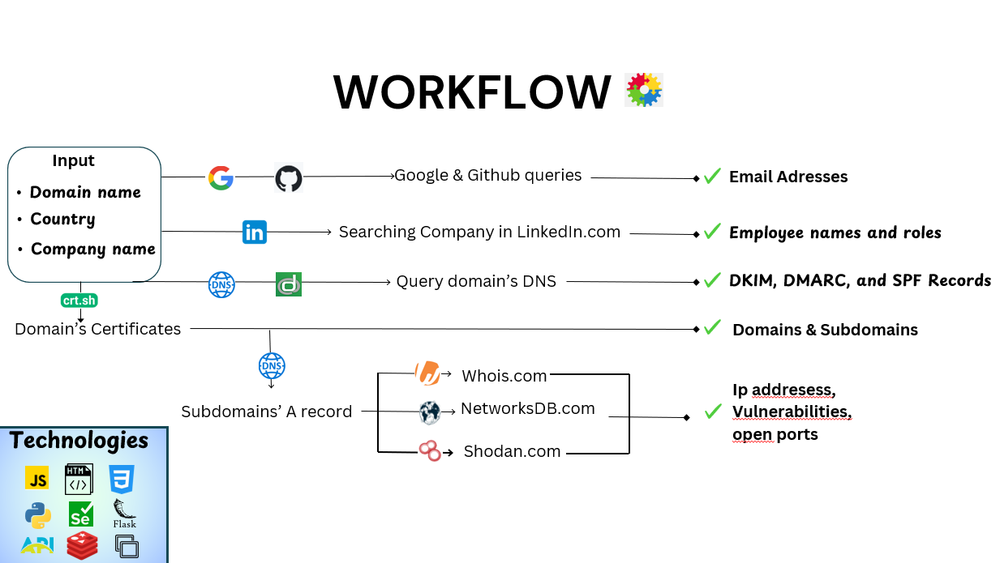

# <p align="center"></p> 

# <p align="center"></p> 
## Welcome to OsinTech
<p class="large-text" style="color: #43c0ce;">Welcome to OsinTech!</p> 

<p class="small-text">
At OsinTech, we harness the power of Open Source Intelligence (OSINT) to collect and analyze publicly available data about a target domain name, company name, and country.
</p> 

<p class="small-text">
Our custom-built Python scripts integrate with leading tools like Shodan, WHOIS, and NetworksDB to extract technical infrastructure data. We also leverage LinkedIn to gather human intelligence, and use GitHub and Google Dorks to uncover code repositories and exposed components linked to the organization.
</p> 

<p class="small-text">
All collected data is compiled into a detailed report, providing insights into your digital footprint, exposures, vulnerabilities, and recommendations.
Whether you're a cybersecurity professional, researcher, or analyst, OsinTech empowers you with actionable intelligence to assess and reduce online risks to your organization.
</p> 

# <p align="center"></p> 

## ⚙️ Features

- Domain & Subdomain scanning
- Company technology stack detection
- Leaked credentials search (via GitHub Dorks)
- WHOIS and DNS record analysis
- TLS/SSL certificate inspection
- Shodan integration for port and service scanning
- LinkedIn scraping for employee metadata
- Visual reports and exportable results

## Getting Started:

### Prerequisites

- Python 3.10+
- Git
- Vscode

## Installation

1. **Clone the repository:**
    ```bash
    git clone https://github.com/hila302010/final-cyber-project
    ```

2. **Install dependencies:**
    ```bash
    pip install -r requirements.txt
    ```

3. **Install and run Redis:**
    - On Ubuntu:
        ```bash
        sudo apt update
        sudo apt install redis-server
        sudo systemctl start redis
        ```

## Usage

1. **Start the Flask server:**
    ```bash
    python osintech.py
    ```
    The app will open in your browser at [http://localhost:5000](http://localhost:5000).

2. **Use the web interface to enter your target domain, company, and country.**

3. **View and export results from the dashboard.**


##⚠️ Disclaimer
This tool is intended only for educational and ethical purposes.
Unauthorized use of OsinTech against targets without explicit consent may be illegal and is strictly discouraged.

OsinTech/
├── csv_files/ # Generated CSV reports
├── Scripts/
│ ├── githubAndGoogleDorks/ # GitHub scraping & Google Dorking scripts
│ ├── socialNetworkServices/ # LinkedIn and social scraping scripts
│ └── ... # Other modules
├── static/ # Static files: CSS, fonts, images, JS
│ ├── css/
│ ├── fonts/
  └── ... 
├── templates/ # HTML page templates
├── osintech.py # Main application script (Flask server)
├── requirements.txt # Python dependencies
└── README.md # Project documentation

